# Equity

<!-- The Bloomberg query Excel workbook for equity times series is available for download [here](./assets/workbooks/simple interface/equity.xlsm).  -->

<!-- ## Global equity settings -->

<!-- The global settings live on the worksheet named "query":  -->

<!--   
 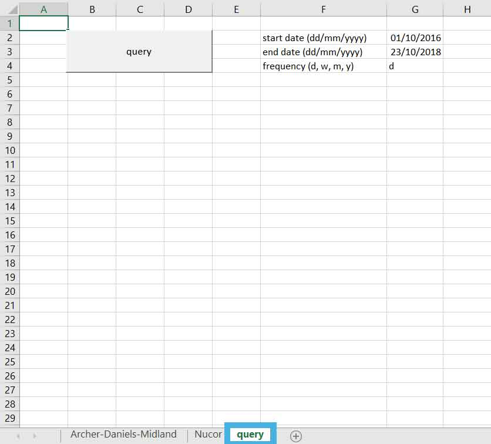 
     -->

<!-- From there, input a start date and end date in the appropriate format (dd/mm/yyyy) as well as a frequency. The data are available at the daily (d), weekly (w), monthly (m) , quarterly (q) and yearly (y) frequencies. Start date, end date and frequency default to 01/01/1970, today's date and daily respectively.  -->

<!-- ## Firm level settings -->

<!-- Assets are mapped to "tickers" in the Bloomberg world. Querying equity data therefore requires the corresponding ticker(s) for the firm or set of firms for which data is desired. Tickers can be found by opening a Bloomberg window and typing a firm's name in the search bar, the firm's ticker will soon appear in the search results. Once collected, tickers can be used here to query time series data for the corresponding firms. This workbook comes with an example query for the Archer-Daniels-Midland (ADM US Equity) and Nucor (NUE US Equity) corporations. Click on the Archer-Daniels-Midland tab:  -->

<!--   
 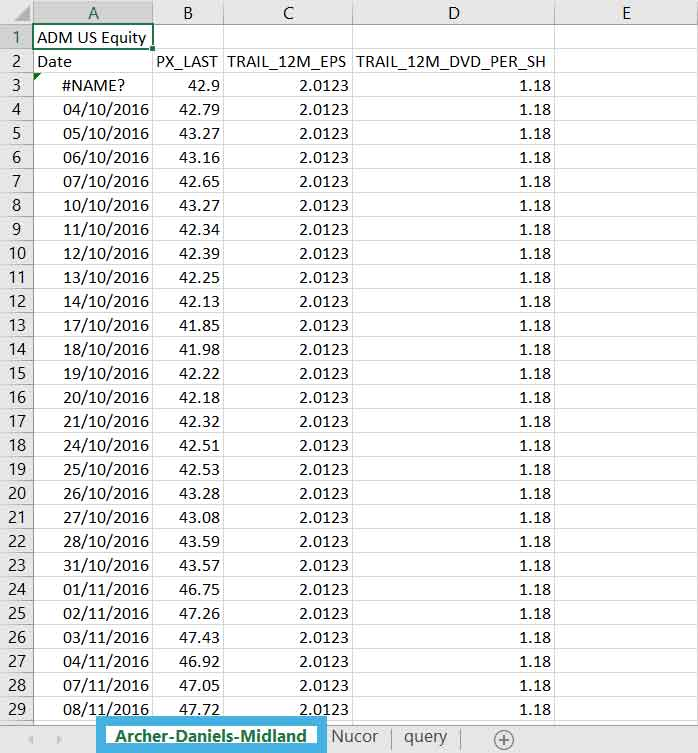 
     -->

<!-- The firm ticker goes in the top left cell ("A1"): "ADM US Equity" is the ticker for Archer-Daniels-Midland. -->

<!--   -->

<!-- Variables are mapped to codes in the Bloomberg world; codes for particular variables can be retrieved from a Bloomberg session by typing variable names in the search bar. The corresponding codes will soon be displayed in the search results. Once collected the codes can be used here to query firm level data. On a firm's spreadsheet the variable codes go on the second row from column "B" onwards:  -->

<!--   
 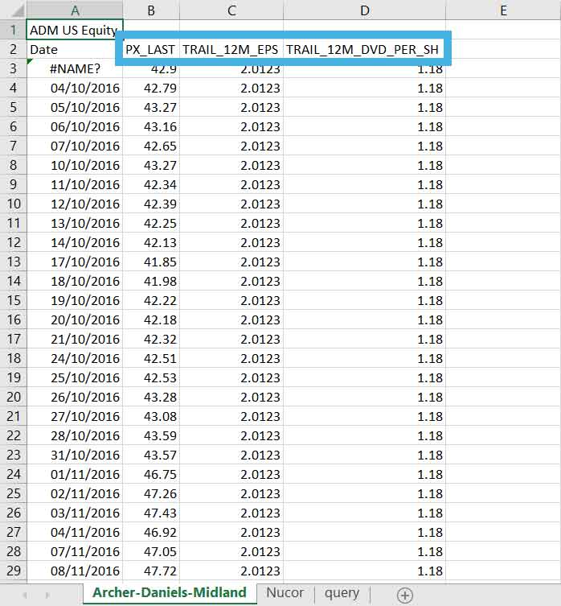 
     -->

<!-- In this example the variables queried for are close price ("PX_LAST"), trailing one year earnings per share ("TRAIL_12M_EPS") and trailing one year dividend ("TRAIL_12M_DVD_PER_SH"). Variables for which data is not available at the desired frequency will be provided at the highest frequency available. In this example the close price data is provided at the daily frequency as required but the EPS and dividend data are reported quarterly with the figures repeated for all dates belonging to the corresponding quarter.   -->
<!-- Any number of variables can be added by inputting their codes in the next available columns. The sales figure ("SALES_REV_TURN") can be added as follows:  -->

<!--   
 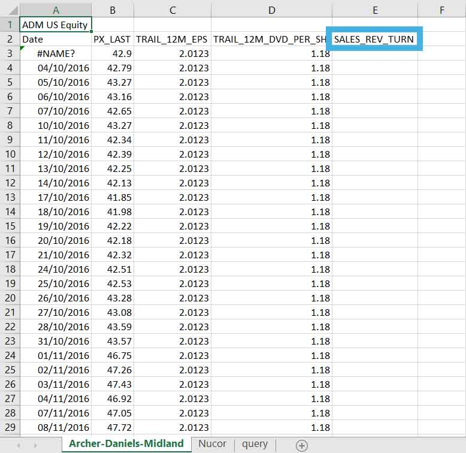 
     -->

<!-- After the query is run the data shows up in the corresponding column(s):   -->

<!--   
 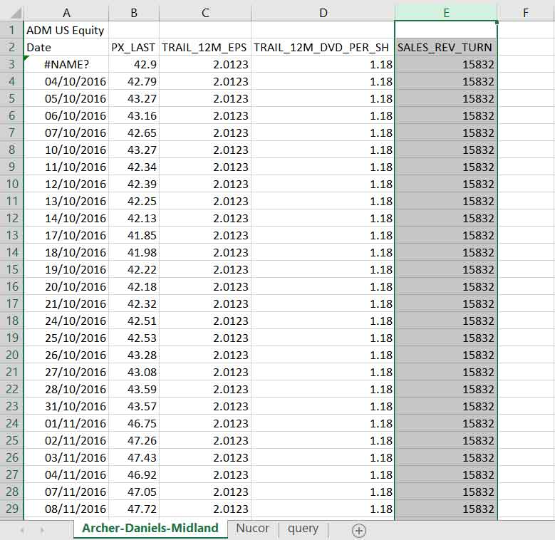 
     -->

<!-- Similarly any number of firms can be added. To add a firm, create a new tab by clicking the plus icon to the right of the rightmost tab:   -->

<!--   
 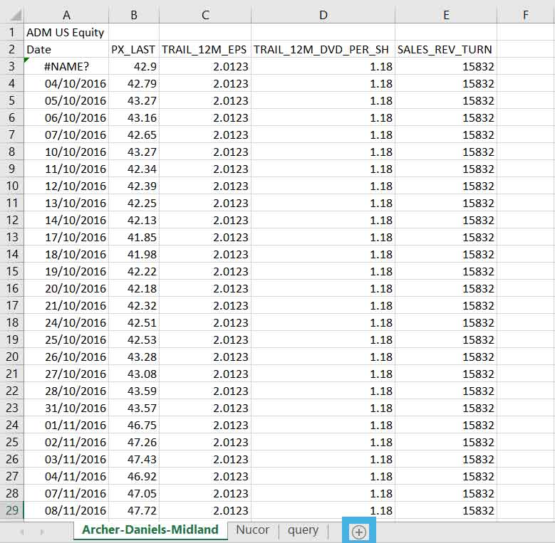 
     -->

<!-- Input a firm's ticker in the top left cell, "KHC US Equity" (Kraft-Heinz corporation) in this case as well as the codes for the desired variables:   -->

<!--   
 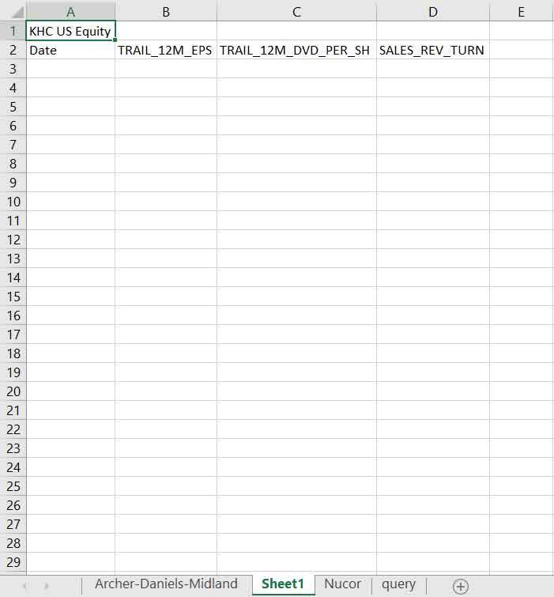 
     -->

<!-- The worksheet can be renamed by right-clicking on the corresponding tab:   -->

<!--   
 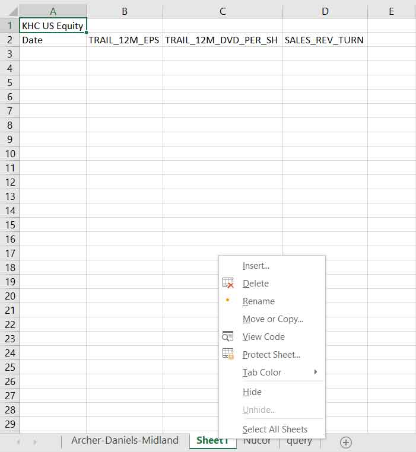 
     -->

<!-- The query can then by run by going back to the "query tab" and clicking the "query" button:  -->

<!--   
 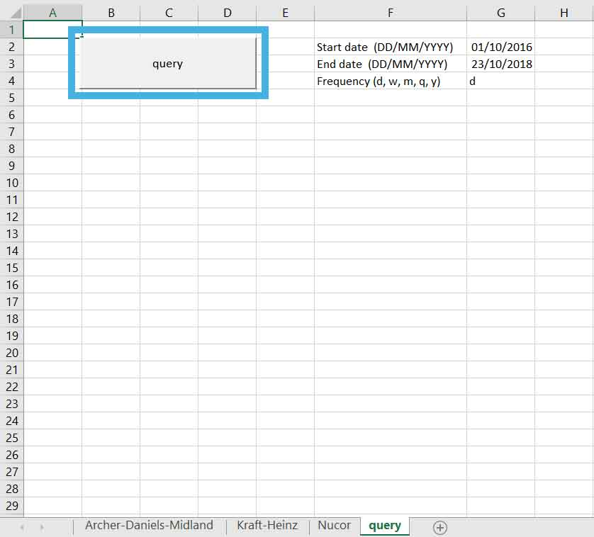 
     -->

<!-- After a few seconds the data should be populated for all firms and variables:   -->

<!--   
 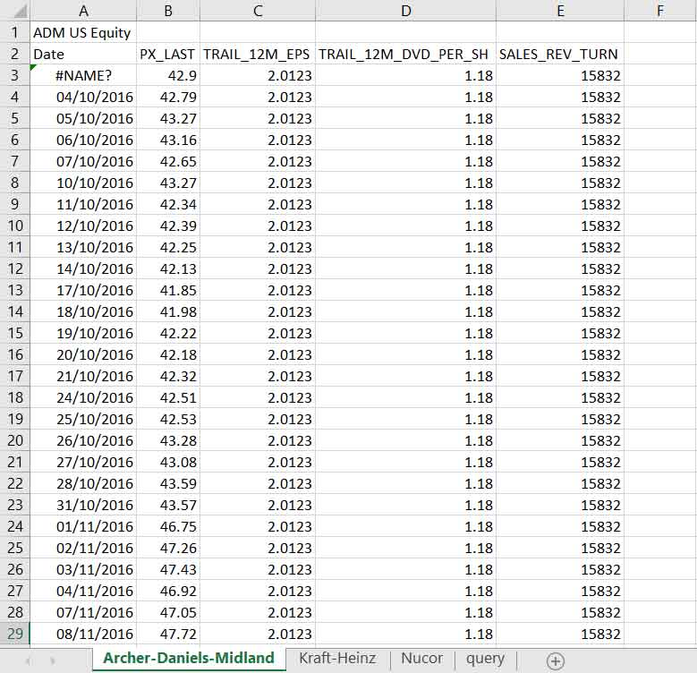{ width=80% } 
   -->
<!--   
 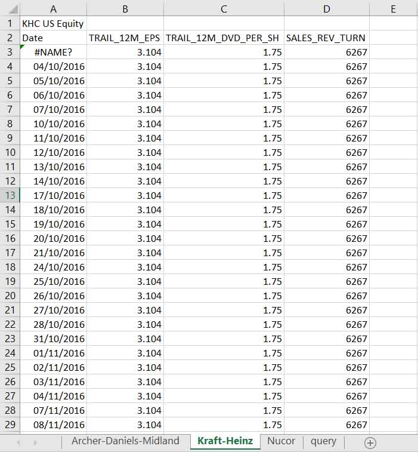{ width=80% } 
    -->
<!--   
 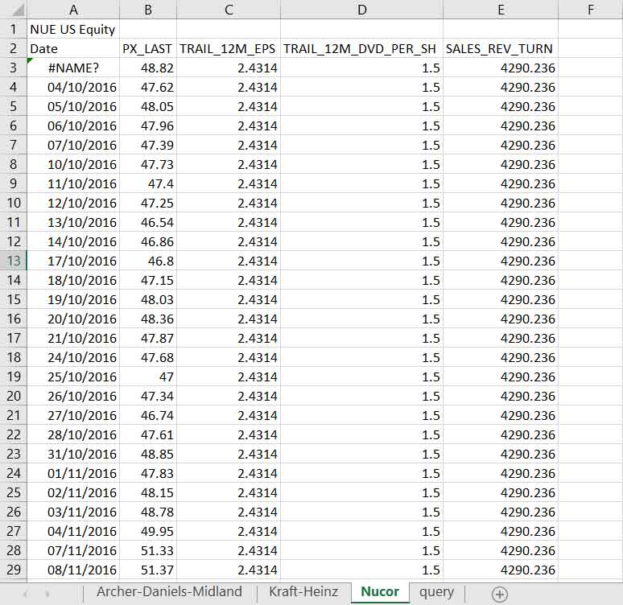{ width=80% } 
     -->

<!-- ## Equity tool: what's coming next -->

<!-- The development of the Bloomberg query tool hereby put forward has now reached the beta version stage; the product is ready for being tested for feedback by end users. The next development stage will be dedicated to user experience, focussing in particular on improving the user interface. User navigation through the data sheets should be limited to the maximum and ideally would become irrelevant. This will be achieved by migrating all settings to the query sheet which shall become the sole interface to the end user:   -->

<!--   
 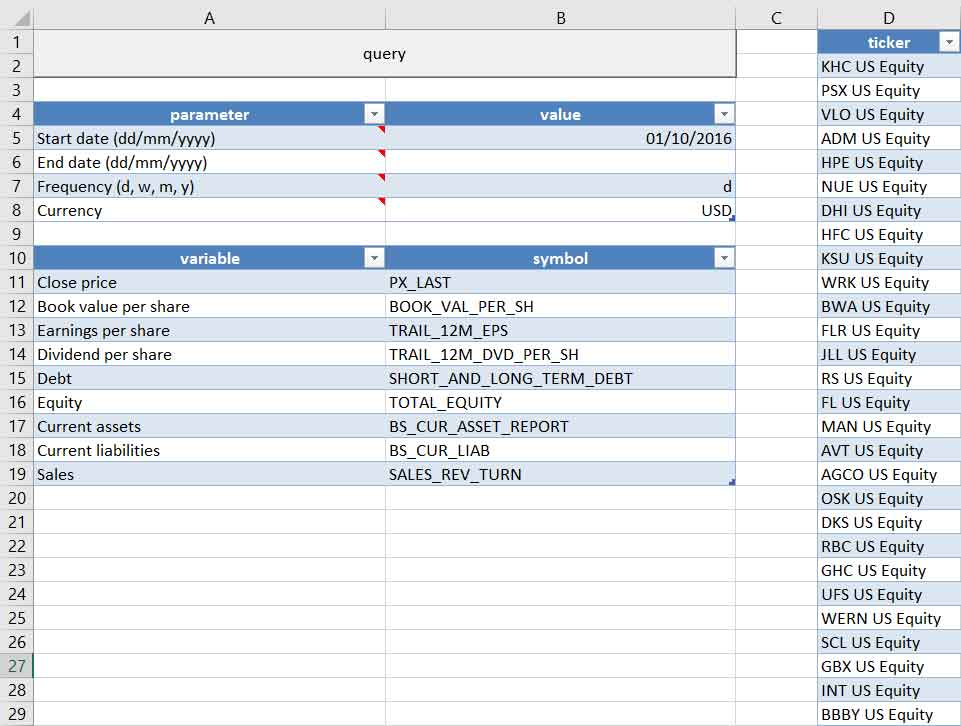{ width=80% } 
     -->

The Bloomberg query Excel workbook for equity times series is available for download [here](./assets/workbooks/advanced interface/equity.xlsm). The user interface to the query engine lives on the "Query" worksheet:  

 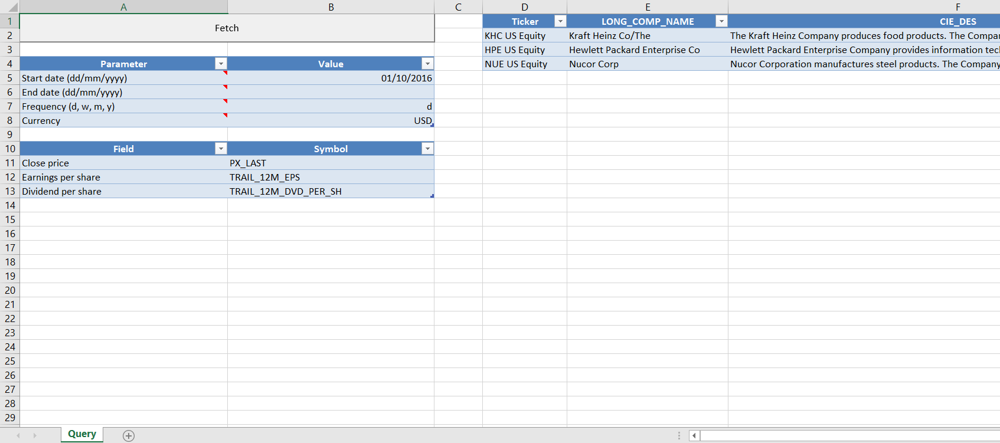 

## Parameters table

 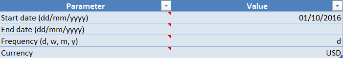 

Parameters for the data query are set to the desired values in a dedicated table:  

* **Start date**: start date for the query here in the following format: dd/mm/yyyy.  
* **End date**: end date for the query here in the following format: dd/mm/yyyy. If omitted, defaults to the current system date.  
* **Frequency**: frequency at which the data should be queried. Available frequencies are "d" (daily), "w" (weekly), "m" (monthly), "q" (quarterly), "y" (yearly).  
* **Currency**: desired currency for the query. If omitted, defaults to the default currency for the security as specified in Bloomberg.

## Fields table

Similarly, desired fields for the query are inserted in a dedicated table: 

 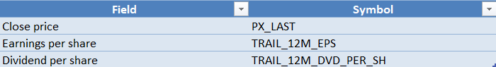 

Variables or fields are mapped to "symbols" in Bloomberg. Symbols can be found by opening a Bloomberg window and typing a variable name in the search bar. In this example the variables queried for include close price ("PX_LAST"), trailing one year earnings per share ("TRAIL_12M_EPS") and trailing one year dividend ("TRAIL_12M_DVD_PER_SH"). Variables for which data is not available at the desired frequency will be provided at the highest frequency available. In this example the close price data is provided at the daily frequency as required but the EPS and dividend data are reported quarterly with the figures repeated for all dates belonging to the corresponding quarter. Query fields are added or deleted by adding or removing rows from the table as desired. This is achieved by right clicking on a cell in the table, navigating to the "insert" tab and selecting the desired action:

* New query field:  

 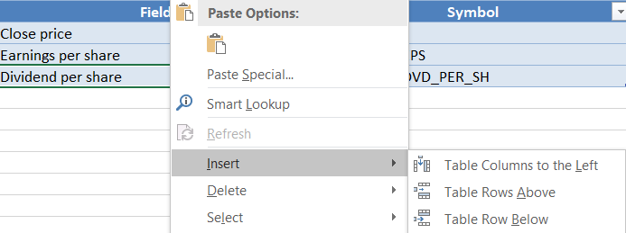 

* Delete query field: 

 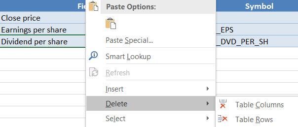 

## Firms table

Assets are mapped to "tickers" in the Bloomberg world. Querying equity data therefore requires the corresponding ticker(s) for the firm or set of firms for which data is desired. Tickers can be found by opening a Bloomberg window and typing a firm's name in the search bar, the firm's ticker will soon appear in the search results. Once collected, tickers can be used here to query time series data for the corresponding firms. This workbook comes with an example query for the Kraft-Heinz ("KHC US Equity"), Hewlett-Packard ("HPE US Equity") and Nucor ("NUE US Equity") corporations. Tickers are added or deleted as desired in the same way as fields are dealt with in the corresponding table as demonstrated above.  

 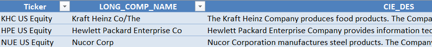 
   

The firms table further allows for static data queries. In other words, static data for the desired tickers can be queried directly from the query sheet using Bloomberg symbols. In this example, names ("LONG_COMP_NAME") and descriptions ("CIE_DES") for the desired firms are fetched. Fields are added or removed by inserting or deleting columns from the table:  

* New query field:   

 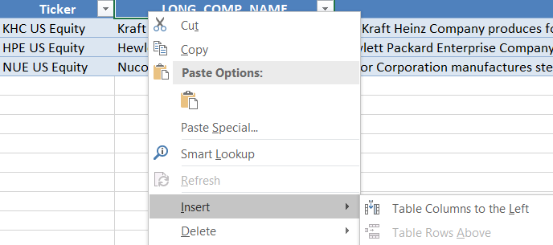 
  

* Delete query field:  

 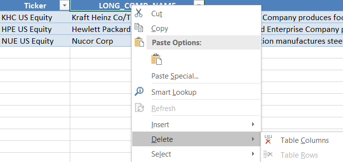 
  

## Fetching data

With the parameters, field symbols and firm tickers inserted in the corresponding tables the query can be run by hitting the "Fetch" button on the top left corner of the spreadsheet. Tabs named after the firm tickers appear to the left of the "Query" tab; after a few seconds each of these is populated with data for the corresponding fields:  

 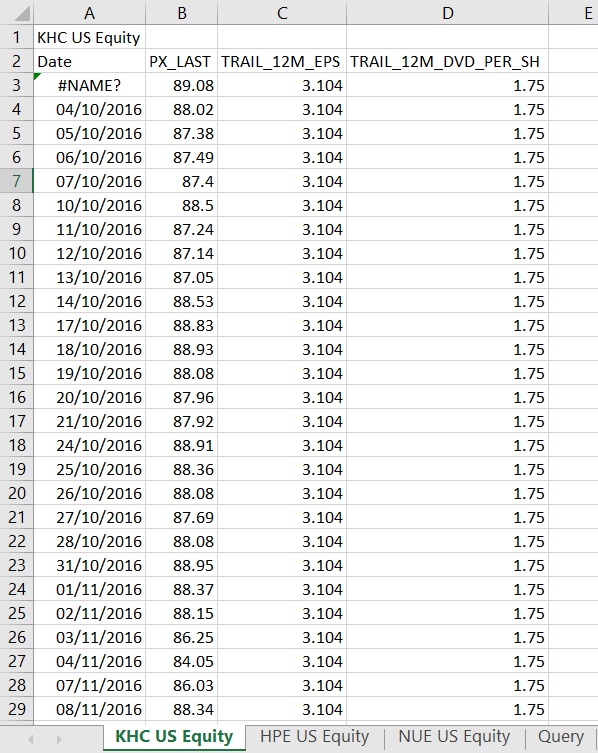 
  

With the data retrieved the query is now completed and the workbook can be saved. It can be updated at a later date by inputting a more recent date for the query "end date" in the parameters table or leaving the slot blank in which case data will be retrieved up to the current date. 

