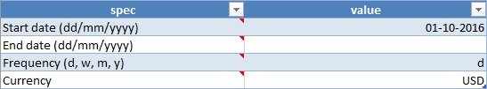
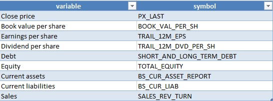
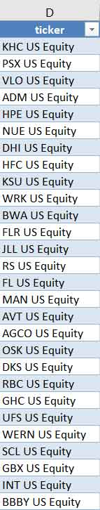
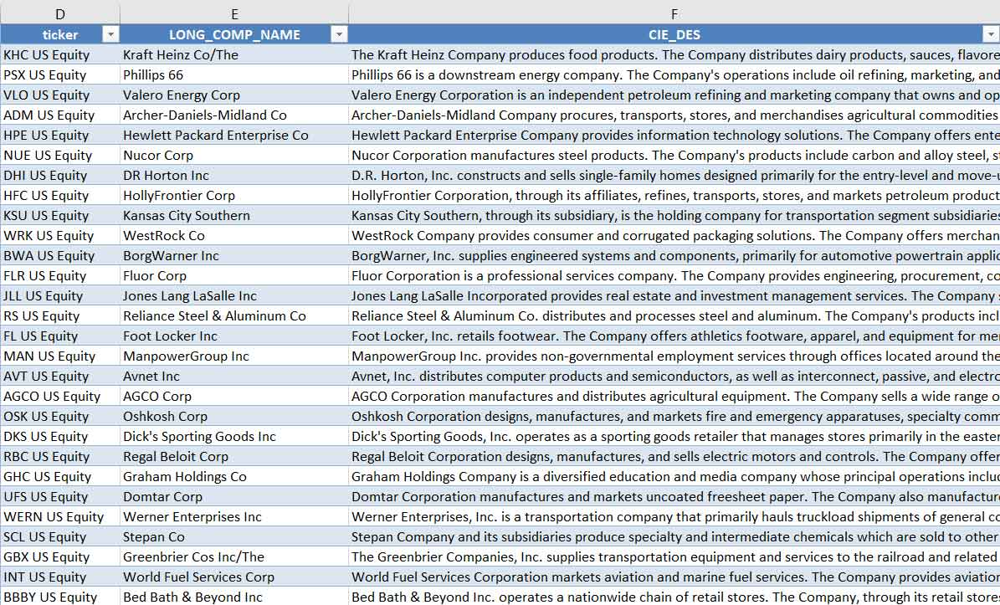
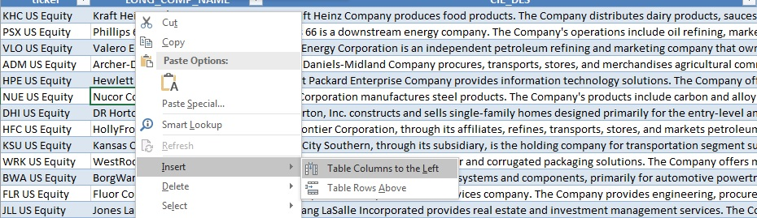
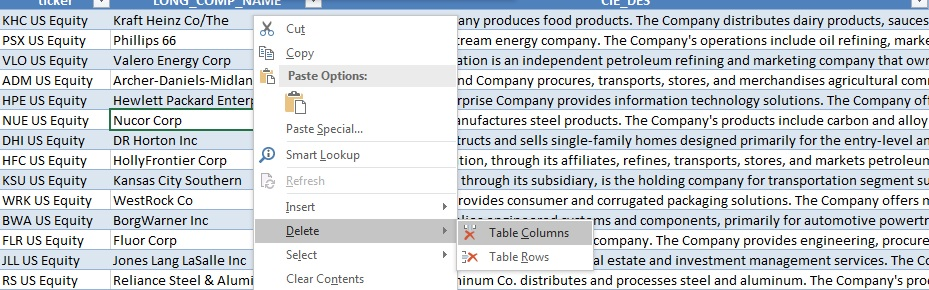

# Equity

The Bloomberg query Excel workbook for equity times series is available for download [here](./assets/workbooks/simple interface/equity.xlsm). 

## Global settings

The global settings live on the worksheet named "query": 

  
  
    

From there, input a start date and end date in the appropriate format (dd/mm/yyyy) as well as a frequency. The data are available at the daily (d), weekly (w), monthly (m) , quarterly (q) and yearly (y) frequencies. Start date, end date and frequency default to 01/01/1970, today's date and daily respectively. 

## Firm level settings

Assets are mapped to "tickers" in the Bloomberg world. Querying equity data therefore requires the corresponding ticker(s) for the firm or set of firms for which data is desired. Tickers can be found by opening a Bloomberg window and typing a firm's name in the search bar, the firm's ticker will soon appear in the search results. Once collected, tickers can be used here to query time series data for the corresponding firms. This workbook comes with an example query for the Archer-Daniels-Midland (ADM US Equity) and Nucor (NUE US Equity) corporations. Click on the Archer-Daniels-Midland tab: 

  
  
    

The firm ticker goes in the top left cell ("A1"): "ADM US Equity" is the ticker for Archer-Daniels-Midland.

 

Variables are mapped to codes in the Bloomberg world; codes for particular variables can be retrieved from a Bloomberg session by typing variable names in the search bar. The corresponding codes will soon be displayed in the search results. Once collected the codes can be used here to query firm level data. On a firm's spreadsheet the variable codes go on the second row from column "B" onwards: 

  
  
    

In this example the variables queried for are close price ("PX_LAST"), trailing one year earnings per share ("TRAIL_12M_EPS") and trailing one year dividend ("TRAIL_12M_DVD_PER_SH"). Variables for which data is not available at the desired frequency will be provided at the highest frequency available. In this example the close price data is provided at the daily frequency as required but the EPS and dividend data are reported quarterly with the figures repeated for all dates belonging to the corresponding quarter.  
Any number of variables can be added by inputting their codes in the next available columns. The sales figure ("SALES_REV_TURN") can be added as follows: 

  
  
    

After the query is run the data shows up in the corresponding column(s):  

  
  
    

Similarly any number of firms can be added. To add a firm, create a new tab by clicking the plus icon to the right of the rightmost tab:  

  
  
    

Input a firm's ticker in the top left cell, "KHC US Equity" (Kraft-Heinz corporation) in this case as well as the codes for the desired variables:  

  
  
    

The worksheet can be renamed by right-clicking on the corresponding tab:  

  
  
    

The query can then by run by going back to the "query tab" and clicking the "query" button: 

  
  
    

After a few seconds the data should be populated for all firms and variables:  

  
 { width=80% } 
  
  
 { width=80% } 
   
  
 { width=80% } 
    

## Coming up

The development of the Bloomberg query tool hereby put forward has now reached the beta version stage; the product is ready for being tested for feedback by end users. The next development stage will be dedicated to user experience, focussing in particular on improving the user interface. User navigation through the data sheets should be limited to the maximum and ideally would become irrelevant. This will be achieved by migrating all settings to the query sheet which shall become the sole interface to the end user:  

  
 { width=80% } 
    

### Parameters table

  

Parameters for the data query will be set to the desired values in a dedicated table:  

* **Start date**: start date for the query here in the following format: dd/mm/yyyy.  
* **End date**: end date for the query here in the following format: dd/mm/yyyy. If omitted, defaults to the current system date.  
* **Frequency**: frequency at which you want the data to be queried. Available frequencies are "d" (daily), "w" (weekly), "m" (monthly), "q" (quarterly), "y" (yearly).  
* **Currency**: insert the desired currency for the query. If omitted, defaults to the default currency for the security as specified in Bloomberg.

### Fields table

Similarly, desired variables for the query will be input in a dedicated table: 

  

The desired field(s) for the data query will be indicated by the user in this table using the corresponding Bloomberg symbol(s). Query fields will be added or deleted by adding or removing rows from the table as desired. This will be achieved by right clicking on a cell in the table, navigating to the "insert" tab and selecting the desired action:

* New query field:  

  

* Delete query field: 

  

### Tickers table

Tickers will also live on a dedicated table where they will be input by the user in a single column format: 

  
  

Tickers will be added or deleted as desired in the same way as fields are dealt with in the corresponding table as demonstrated above.  

### Static data table

The tickers table will eventually allow for static data queries. In other words, the user will be able to query static data for the desired tickers directly from the query sheet:  

  

Fields will be added or removed by inserting or deleting columns from the table:  

* New query field:  

  

* Delete query field:  

  

