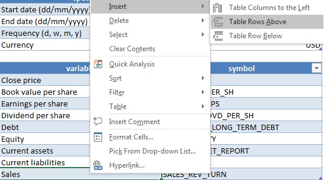
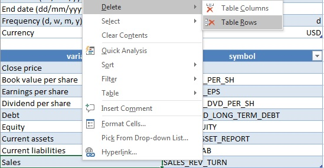
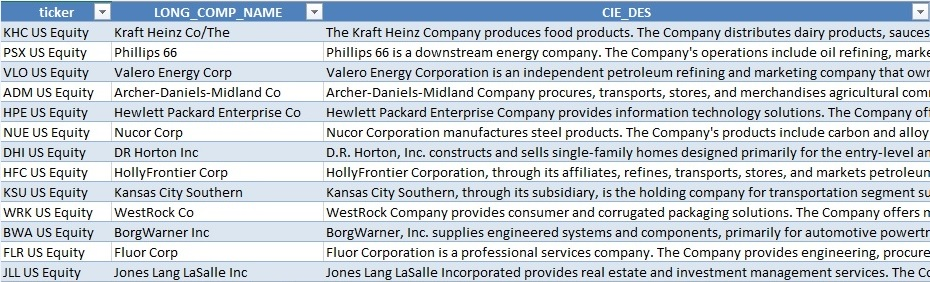
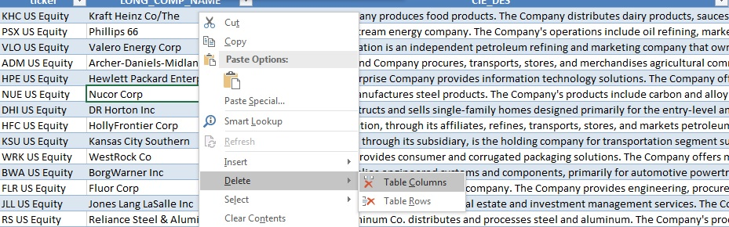
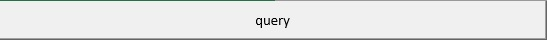

# Equity data extractor

Download VBA augmented Excel workbook [here](./assets/equity.xlsm). Don't forget to enable macros!

#### Specs table

  

Set parameters for the data query to the desired values in this table. These include:  

* Start date: insert start date for the query here in the following format: dd/mm/yyyy.  
* End date: insert end date for the query here in the following format: dd/mm/yyyy. If omitted, defaults to the current system date.  
* Frequency: select the frequency at which you want the data to be queried. Accepted values are "d" (daily), "w" (weekly), "m" (monthly), "y" (yearly).  
* Currency: insert the desired currency for the query. If omitted, defaults to the default currency for the security as specified in Bloomberg.

#### Fields table

  

Indicate the desired field(s) for the data query in this table by using the corresponding Bloomberg symbol(s). Bloomberg uses symbols to refer to security variables. You can find desired field symbols on a Bloomberg terminal by typing the full name of a variable in the search bar of a Bloomberg window and hitting the GO button. The corresponding symbol will appear in search results. For instance the Bloomberg symbol for a security close price is "PX_LAST" while that for the book value per share is "BOOK_VAL_PER_SH", etc. Add or delete fields from the table as desired for the corresponding query. Add a new field by adding a row to the table and filling the corresponding values. Right clic on a cell in the table, navigate to the "insert" tab and select the desired action:

  

Delete fields in a similar way:

  

#### Tickers table

  

Indicate the desired security(ies) for the data query in this table by using the corresponding Bloomberg ticker(s). Bloomberg uses tickers to refer to securities. You can find desired tickers on a Bloomberg terminal by typing the full name of a security in the search bar of a Bloomberg window and hitting the GO button. The corresponding ticker will appear in search results. For example the Bloomberg ticker for the Archer-Daniels-Midland corporation is "ADM US Equity" while that for Hewlett Packard is "HPE US Equity", etc. Add or delete tickers from the table as desired in the same way as you add or delete fields in the fields table as demonstrated above. This table also queries static, qualitative data for the corresponding securities. Add or delete fields from the table as desired for the corresponding query. Add a new field by adding a column to the table and filling the corresponding values. Right clic on a cell in the table, navigate to the "insert" tab and select the desired action:

  

Delete fields in a similar way:

  

#### Query

  

Once you're all set hit the query button and wait for the data to be fetched. Note that you must be on a working Bloomberg terminal with an open Bloomberg session to be able to successfully run the query.

