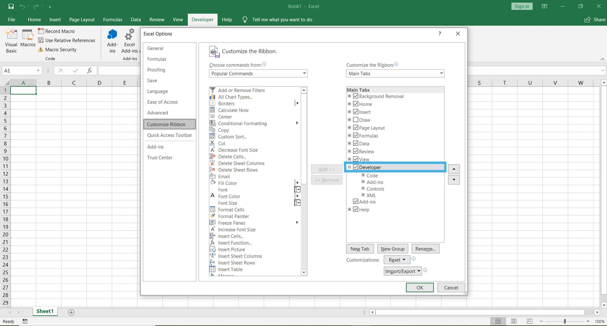
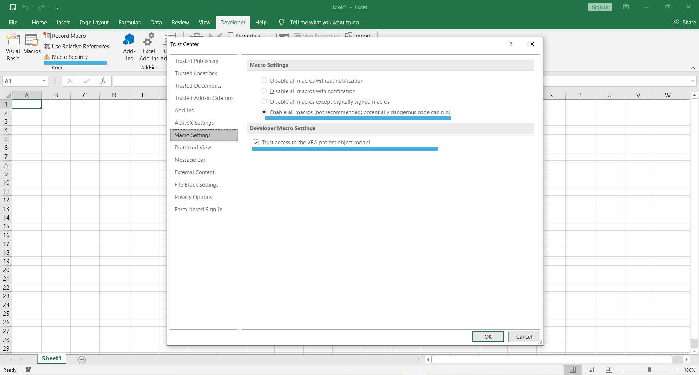

--- 
title: "Bloomberg Excel systematic query tools for end of the day time series data"
author: "Olivier Bauthéac"
date: ""
description: "Excel tools for systematic end of the day (EOD) data retrieval from Bloomberg."
github-repo: "bautheac/bbgvba"
site: bookdown::bookdown_site
documentclass: book
# bibliography: ["references.bib", packages.bib]
biblio-style: apalike
link-citations: yes
---

# At a glance

The Bloomberg Terminal is a modern icon of financial markets. It delivers unparalleled coverage of markets and securities with information across asset classes--from fixed income to equities, to foreign exchange, commodities and derivatives--integrated in one place and delivered in real time to any internet connected desktop or mobile device. The Bloomberg Office Tools suite comes with an Excel add-in that allows the user to pull Bloomberg data directly from any Excel workbook. The Excel add-in seems designed for convenience and immediate ibidem data consumption and consequently comes with a few shortcomings when further processing out of Excel, potentially repeated in time, is involved. The data retrieved for research in finance is typically meant to be further processed and analysed using a programming language (R, Python, etc.) or a data processing software (Stata, Eviews, etc.). The Excel add-in packs all the query results into a single spreadsheet, mixing tickers and variables, which makes further computational processing rather tedious. Besides the add-in takes a singleton approach to the data query and is not well designed for recurrence. The available "refresh" function updates the query living on a particular spreadsheet by filling potential existing gaps but does not complement the time series beyond the date it was originally made. In other words, a query made sometimes last year for a particular set of assets and variables could originally have shown missing data for some combination(s) of asset(s), variable(s) and date(s) or period(s). The missing data could have been added to the Bloomberg database since the query was made and refreshing the query today would fill the corresponding gaps. It would not however update the time series with data beyond the date of the original the query and the user would be left missing data for the period from the original query date to the current date. Time series data plays a central role in finance and financial economics; these defects therefore come at a significant cost in convenience for research work in those fields. The query engines offered here address these issues and provide the researcher with convenient tools for querying and updating financial end of the day time series data.

# Preliminary configuration

## Bloomberg

The tools offered here only work on a Bloomberg terminal or any device with a connection to Bloomberg. Make sure the Bloomberg Office Tools are installed and that a Bloomberg session is open before proceeding further. 

## Excel

Macros are required for the query tools hereby put forward to work properly but are disabled by default in Excel. To enable them the developer tools have to be accessible from the Excel ribbon. Clicking File, Options, Customize Ribbon in an open Excel workbook opens a page similar to the following:  

  
  
    

Make sure the "Developer" box is ticked and click OK. the Developer tools tab now shows up in the Excel ribbon. From the developer tools tab click "Macro Security" and enable macros by ticking two boxes on the corresponding settings page:  

  
  
    

Click OK. Macros are now enabled; you're all set.
